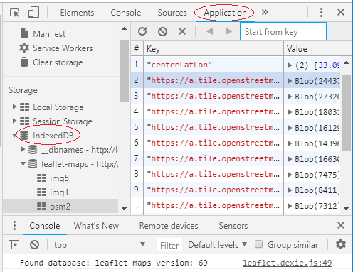

Leaflet.dexie.js
================
A Leaflet plugin for local persistant storage using library [Dexie.js](https://github.com/dfahlander/Dexie.js).

### Demo
The [Demo](index.html) implements creation and deletion of offline maps and can simulate offline map display.

### Code sample
```html
<!doctype html>
<html>
 <head>
	<link rel="stylesheet" href="https://unpkg.com/leaflet@1.3.1/dist/leaflet.css" />
	<script src="https://unpkg.com/leaflet@1.3.1/dist/leaflet.js"></script>   
	<script src="https://unpkg.com/dexie/dist/dexie.min.js"></script>
	<script src="leaflet.dexie.js"></script>
 </head>
 <body>
	<div id="map" style="height: 75vh"></div>
	press F12 to open Inspector, watch indexedDB in tab <i>Application</i>(Chrome) or <i>Storage</i>(FF)
  <script>
	var baseLayer = L.tileLayer.offline('http://{s}.tile.openstreetmap.org/{z}/{x}/{y}.png', { subdomains: 'abc', maxZoom: 16});
	var control = L.control.savetiles(baseLayer, {});

	var map = L.map('map');
	baseLayer.addTo(map);
	control.addTo(map);

	const tblName = 'test';
	control._db.version(1).stores( { [tblName]: '' });	// create table
	control.openDB().then(() => {
		control.setTable(tblName);
		control.putItem('mapCenter', { lat: 47.2572, lng: 3.6842 });		// write
	}).then(() => {
		control.getItem('mapCenter').then(value => map.setView(value, 14));	// read
	}).catch(err => alert(err.message));
  </script>
 </body>
</html>
```

leaflet.dexie code is based on [leaflet.offline](https://github.com/allartk/leaflet.offline), which uses [localForage](https://github.com/localForage/localForage) to access indexedDB. 
&emsp; In our opinion (after lots of coding & testing), [Dexie.js](https://github.com/dfahlander/Dexie.js) is a better solution - smaller size, efficient and well supported.

### Usage
Main usage is for offline maps, but could be also used to store any other map related information.

&emsp;

### IndexedDB
[indexedDB](https://developer.mozilla.org/en-US/docs/Web/API/IndexedDB_API) is the standard database in the browser.
Press F12 to inspect, watch indexedDB in tab *Application*(Chrome) or *Storage*(FF).



